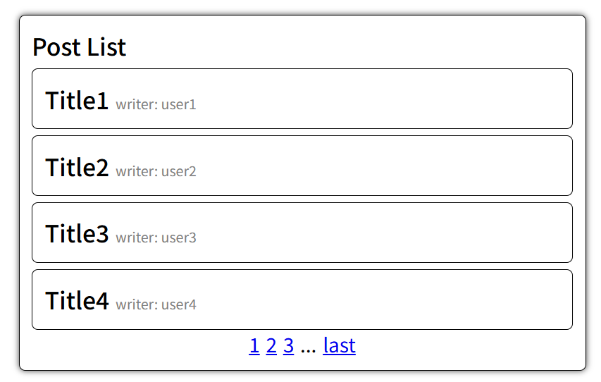
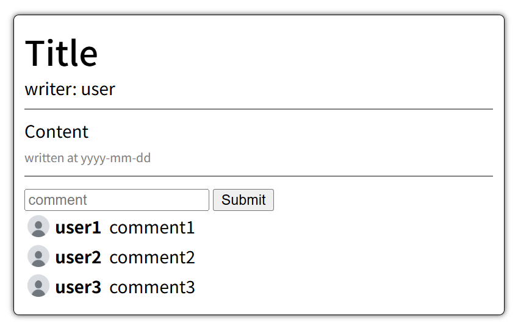
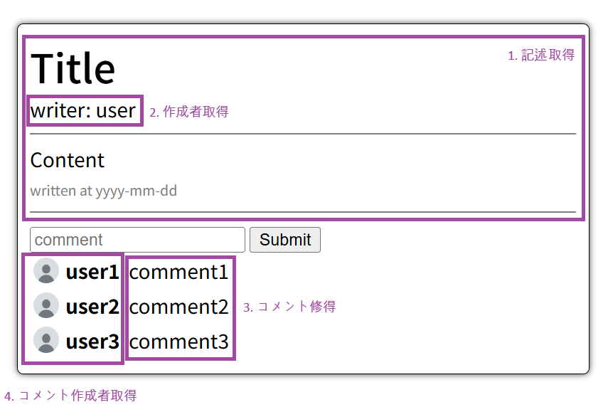

# GraphQLとは
GraphQL(グラフキューアール)は
APIのためのクエリ言語で、クライアントはクエリを使って指定した構造で必要なデータだけを取得できます。

REST APIと比べながらこれについてもっと調べてみましょう。

## Rest APIとの比較

掲示板サービスを例に挙げて解説します。

### Overfetching(オーバーフェッチング)



上のような記事の目録を見せる画面があるとします。
REST APIを使う場合、サーバーから次のようなデータを取得します。
```json5
// 目録に表す記事の情報
// uri = /posts?page=1&size=4
[
  {
    "title": "Title1",
    "writerId": "userId1",
    "content": "...",
    "writtenAt": "yyyy-mm-dd"
  },
  {
    "title": "Title2",
    "writerId": "userId2",
    "content": "...",
    "writtenAt": "yyyy-mm-dd hh:mm:ss"
  },
  //...
]
```

```json5
// writerの情報を表すため取得するユーザーの情報
// uri = /users/userId1
{
  "userId": "userId1",
  "email": "test@e.mail",
  "nickname": "user1",
  "joinedAt": "yyyy-mm-dd hh:mm:ss",
  "profileImage": "..."
}
```

ここで問題が発生します。
表示するのは記事のタイトルとユーザーのニックネームだけですが、不要なデータまで取得してしまいます。

このように、実際には必要のないデータまで取得してしまう問題を
**Overfetching(オーバーフェッチング)**と呼びます。

ですが、GraphQLは必要なデータだけを取得できるため、そんな問題が発生しません。
次はGraphQLを使ったリクエストのクエリと取得したデータです。

```
query GetPost {
    posts(page: 1, size: 4) {
        title
        writer {
            nickname
        }
    }
}
```

```json5
[
  {
    "title": "Title1",
    "writer": {
      "nickname": "user1"
    }
  },
  {
    "title": "Title2",
    "writer": {
      "nickname": "user2"
    }
  },
  //...
]
```

必要なデータだけを指定して必要なデータだけを取得します。
このようにGraphQLを使うことで、Overfetchingの問題を解決することができます。

### Underfetching(アンダーフェッチング)

データを必要以上取得するOverfetchingがある一方で、必要なデータを一度のリクエストで取得できないUnderfetchingという問題もあります。



上のページを表示するためREST APIを使ったら、次のように複数のリクエストを送らなければなりません。



次は、上のページを表示するためにサーバーから取得するデータの例です。

```json5
// uri : /posts/{postId}
{
    "title": "Title",
    "writerId": "userId1",
    "content": "...",
    "writtenAt": "yyyy-mm-dd"
}
```

```json5
// uri : /users/{userId}
{
  "userId": "user",
  "email": "test@e.mail",
  "nickname": "user",
  "joinedAt": "yyyy-mm-dd hh:mm:ss",
  "profileImage": "..."
}
```

```json5
// uri : /posts/{postId}/comments
[
  {
    "commentId": "commend1",
    "content": "comment1",
    "writerId": "user1",
    "writtenAt": "yyyy-mm-dd hh:mm:ss",
  },
  // ...
]
```

REST APIを使ったら一度のリクエストで必要なデータを取得できないため、複数のリクエストを送るべきです。
このような問題を**Underfetching(アンダーフェッチング)**と呼びます。

このUnderfetching問題もGraphQLで解決することができます。
GraphQLのクエリでは、関連するデータもまとめて取得することができます。そのため、複数のリクエストを送る必要がありません。

```
query GetPost {
    post(id: "postId") {
        title
        content
        writtenAt
        writer {
            nickname
        }
        comments {
            content
            writer {
                nickname
                profileImage
            }
        }
    }
}
```

```json
{
  "title": "Title",
  "content": "content",
  "writtenAt": "yyyy-mm-dd hh:mm:ss",
  "writer": {
    "nickname": "user"
  },
  "comments": [
    {
      "content": "comment1",
      "writer": {
        "nickname": "user1"
      }
    },
    {
      "content": "comment2",
      "writer": {
        "nickname": "user2"
      }
    },
    {
      "content": "comment3",
      "writer": {
        "nickname": "user3"
      }
    }
  ]
}
```

記事だけのデータを取得せず、連関する作成者のデータとコメント、コメントの作成者のデータまでも一度に取得して、REST APIのUnderfetching問題が解決できました。

これまで、Overfetching問題とUnderfetching問題を通して、GraphQLの長所を調べてみました。

# GraphQLを調べてみよう

では、本格的にGraphQLを調べてみよう。

## Graphで考えましょう

GraphQLではデータとデータの間の関係をグラフのように扱います。

ここでも掲示板のシステムを例に挙げることにします。

掲示板システムに必要なデータにはユーザー、記事、コメントなどがあり、データとデータの間には「ユーザーは記事を作成する。」と「記事にはコメントが含まれている。」などの関係があるはずです。
そして、このようなデータと関係は次のようにグラフで表せます。



ここで、GraphQLを使って上のUnderfetchingの例のように記事のデータを取得すると次のようなデータ取得が必要になります。
1. 指定した記事を取得
2. その記事の作成者のIDで作成者のデータを取得
3. 記事に含まれているコメントを取得
4. コメントの作成者のIDで作成者のデータを取得



記事データの取得を起点として、
そのデータと関係するほかのデータも取得していきます。

これがGraphQLのグラフ理論という背景です。

## GraphQLの使い方

GraphQLはクエリ言語に過ぎないため、言語や環境によって使い方が違います。

ここでは、共通に使われる`.graphqls`ファイルとクエリの作成法について記述します。

### サーバー側の`.graphqls`ファイル作成法

`.graphqls`はサーバー側で作成するファイルです。
`.graphqls`の`s`はschemaを意味し、このファイルではデータの構造とエントリーポイントを定義します。

ファイルの構成は次のようです。
1. **type** - ドメインモデル定義
2. **query** - データを取得(CRUDのRead作業)するためのエントリーポイントを定義
3. **mutation** - データ取得(Read)以外のCreate / Update / Delete作業を処理するためのエントリーポイントを定義
4. **input** - mutationにデータを送る時、使用されるデータの構造を定義
5. **subscription** - データが変更・追加された際、通知を受け取るためのエントリーポイントを定義

.qraphqlsファイルの例を揚げます。
例として使うため、簡単に作成したものです。

```graphql
# データスキーマ定義
type Writer {
    id: ID!
    name: String!
    description: String
    books: [Book!]!
}

type Book {
    id: ID!
    title: String!
    description: String
    writer: Writer!
}

# データ取得のためのQuery定義
type Query {
    getWriter(id: ID!): Writer

    getBook(id: ID!): Book
    getAllBooks: [Book!]!
    getBooksWithPaging(first: Int!, offset: Int): [Book!]!
}

# データの取得以外の作業のためのMutation定義
type Mutation {
    addWriter(input: newWriterInfo!): Writer!
    deleteWriter(writerId: ID!): Boolean!

    addBook(input: newBookInfo!): Book!
    deleteBook(bookId: ID!): Boolean!
}

# Mutationで使用する入力データ
input newWriterInfo {
    id: ID!
    name: String!
    description: String
}

input newBookInfo {
    id: ID!
    title: String!
    description: String
    writerId: ID!
}

# Subscription定義
type Subscription {
    bookRegistered: Book

    bookRegisteredByWriter(writerId: ID!): Book
}
```

ここで定義したスキーマは、後のQueryの書き方の説明でも使用します。

### クライアント側のクエリの作成法

今からはリクエストを伝送するためのクエリの作成する方法を調べてみます。

まずデータを取得するためのクエリから見ます。

下のように`query { ... }`のなかエントリーポイントとフィールドを指定します。

```graphql
# 'BookQuery'は省略しても問題ありません。
# ただし、オペレーション名をつけておくとログやデバッグの際にリクエストを識別しやすくなります。
query BookQuery{
    # トップレベルフィールドはエントリーポイント
    getBook(id: "BOOK-001"){
        # 下は取得するデータのフィールド
        title
        description
        writer {
            name
        }
    }
}
```

ですが、上のクエリには引数がハードコーディングされている問題があります。

[Variable](https://graphql.org/learn/queries/#variables)を使うと引数を動的に指定することができます。

```graphql
# $bookIdのようにVariableの前には$が付きます。
query BookQuery($bookId: ID!) {
    getBook(id: $bookId){
        title
        description
        writer {
            name
        }
    }
}
```

このようにクエリを作成した後、リクエストを送る際にJSONでVariableを指定します。
```json5
{
    "bookId": "BOOK-001"
}
```

続けて取得以外の作業のためのクエリも見てみましょう。
もうデータ取得のクエリを見たので、もう慣れていると思います。

```graphql
# $bookIdはVariable。クエリの場合と同じくJSONで指定します。
mutation DeleteBook($bookId: ID!) {
    # Mutationのエントリーポイント
    deleteBook(bookId: $bookId)
}
```

続けてSubscriptionの例です。
queryとmutationと似ているので別の説明は不要だと思います。

```graphql
subscription SubscribeBookUpdate($writerId: ID!) {
    # Subscriptionのエントリーポイント
    bookRegisteredByWriter(writerId: $writerId) {
        # 通知をもらった時、取得するデータのフィールド
        id
        title
    }
}
```

# 終わりに

勉強しながら作成した記事であるため、足りない部分が有ると思います。

そして、GraphQLの内容はこの記事で扱ったものの以外にもたっぷり有るので、この短い記事では全体の百分の一も紹介できませんでした。
GraphQLについてもっと知りたくなったらぜひ[公式ドキュメント](https://graphql.org/learn/)と本を読んでみて下さい。

最後に、私がGraphQLとREST APIを比べて説明する時、GraphQLのメリットだけを書きましたが、「銀弾丸はない」という言葉のようにGraphQLも完璧なものはないです。すべてのプロジェクトに無理やりに導入するのはやめてください。

これでこの記事を終わります。
少しでも参考になれば幸いです。


実装編の記事は、準備ができ次第こちらにリンクを掲載いたします。